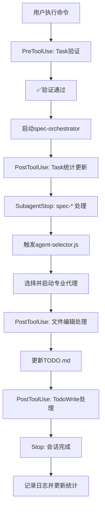

# 🔗 Claude Code Hooks 触发机制详细文档

> **多层智能代理协调系统 - Hooks自动化流程说明**\
> 基于 `.claude/settings.local.json` 配置的事件驱动自动化系统

---

## 📋 概述

Claude Code Hooks 是事件驱动的自动化系统，在特定的Claude
Code生命周期事件发生时自动执行预定义的命令。我们的多层代理系统利用这些Hooks实现任务状态自动更新、代理协调和项目管理。

---

## 🎯 Hook事件类型和触发时机

### **1. PreToolUse - 工具使用前触发**

**触发时机**：Claude准备使用工具之前（可以阻止工具执行）

#### **Hook 1.1: Task执行前验证**

```json
{
    "matcher": "Task",
    "hooks": [{
        "type": "command",
        "command": "node agents/todo-hook-manager.js validate-task-prerequisites",
        "timeout": 10000
    }]
}
```

**🔍 触发条件**：当Claude准备启动一个子代理任务（Task工具）时\
**⚡ 执行动作**：

- 验证任务的前置条件是否满足
- 检查依赖任务是否完成
- 验证必要的文件和资源是否存在
- 如果验证失败，可以阻止任务执行

**💡 实际场景**：

```
用户: @agents/spec-developer 开始实施任务
  ↓ PreToolUse触发
  ↓ 验证前置条件...
  ↓ ✅ 验证通过 → 继续执行任务
  ↓ ❌ 验证失败 → 阻止任务并返回错误
```

#### **Hook 1.2: 文件编辑前安全检查**

```json
{
    "matcher": "Edit|MultiEdit|Write",
    "hooks": [{
        "type": "command",
        "command": "python3 -c \"import json, sys; data=json.load(sys.stdin); path=data.get('tool_input',{}).get('file_path',''); sys.exit(2 if any(p in path for p in ['.env', 'package-lock.json', '.git/', 'node_modules/']) else 0)\"",
        "timeout": 5000
    }]
}
```

**🔍 触发条件**：当Claude准备编辑、创建或写入文件时\
**⚡ 执行动作**：

- 检查目标文件路径是否安全
- 阻止编辑敏感文件（.env、.git/、node_modules/等）
- 防止意外修改系统文件

**💡 实际场景**：

```
Claude: 正在编辑 src/app.js
  ↓ PreToolUse触发
  ↓ 安全检查通过 → 允许编辑

Claude: 正在编辑 .env
  ↓ PreToolUse触发  
  ↓ 安全检查失败 → 阻止编辑，提示错误
```

---

### **2. PostToolUse - 工具使用后触发**

**触发时机**：Claude成功使用工具之后

#### **Hook 2.1: 文件编辑后状态更新**

```json
{
    "matcher": "Edit|MultiEdit|Write",
    "hooks": [{
        "type": "command",
        "command": "node agents/todo-hook-manager.js handle-file-change",
        "timeout": 30000
    }]
}
```

**🔍 触发条件**：文件被成功编辑、创建或写入后\
**⚡ 执行动作**：

- 检测哪些任务与修改的文件相关
- 自动更新相关任务的状态为"进行中"或"完成"
- 更新TODO.md中的进度追踪
- 触发相关任务的自动检查

**💡 实际场景**：

```
Claude编辑: src/components/Header.tsx
  ↓ PostToolUse触发
  ↓ 检测到与任务"实现Header组件"相关
  ↓ 自动更新TODO.md: ✅ Header组件实现完成
  ↓ 检查是否触发下一个任务
```

#### **Hook 2.2: Task任务完成后统计**

```json
{
    "matcher": "Task",
    "hooks": [{
        "type": "command",
        "command": "node agents/todo-hook-manager.js update-stats",
        "timeout": 15000
    }]
}
```

**🔍 触发条件**：子代理任务（Task）执行完成后\
**⚡ 执行动作**：

- 更新项目统计信息（完成任务数、进度百分比）
- 记录任务执行时间和性能指标
- 更新代理工作负载分布
- 生成进度报告

**💡 实际场景**：

```
@agents/spec-developer 任务完成
  ↓ PostToolUse触发
  ↓ 更新统计: 总任务18个，已完成3个
  ↓ 更新TODO.md进度条: 16.7%
  ↓ 记录性能指标
```

#### **Hook 2.3: TODO写入后同步**

```json
{
    "matcher": "TodoWrite",
    "hooks": [{
        "type": "command",
        "command": "node agents/todo-hook-manager.js update-stats",
        "timeout": 10000
    }]
}
```

**🔍 触发条件**：使用TodoWrite工具更新TODO.md后\
**⚡ 执行动作**：

- 同步TODO状态到项目仪表板
- 重新计算项目进度统计
- 更新任务依赖关系图
- 检查是否需要触发新任务

---

### **3. SubagentStop - 子代理停止时触发**

**触发时机**：子代理任务完成并停止时

#### **Hook 3.1: 通用子代理完成处理**

```json
{
    "matcher": "*",
    "hooks": [
        {
            "type": "command",
            "command": "node agents/todo-hook-manager.js handle-task-complete",
            "timeout": 45000
        },
        {
            "type": "command",
            "command": "git add . && git commit -m \"Auto-commit: Agent task completed - $(date)\" || true",
            "timeout": 20000
        }
    ]
}
```

**🔍 触发条件**：任何子代理任务完成时\
**⚡ 执行动作**：

- **第一个命令**：标记任务完成，触发下一个任务
- **第二个命令**：自动Git提交，记录代理工作成果

**💡 实际场景**：

```
@agents/ui-ux-master 完成设计任务
  ↓ SubagentStop触发
  ↓ 1. 标记"UI设计"任务完成
  ↓ 2. 触发下一个任务"前端实现"
  ↓ 3. Git自动提交: "Auto-commit: Agent task completed - 2025-01-17 15:30"
```

#### **Hook 3.2: Specialist代理特殊处理**

```json
{
    "matcher": "spec-*",
    "hooks": [{
        "type": "command",
        "command": "node agents/agent-selector.js trigger-next-phase",
        "timeout": 30000
    }]
}
```

**🔍 触发条件**：specialist代理（spec-开头）完成时\
**⚡ 执行动作**：

- 触发下一阶段的智能代理选择
- 根据当前阶段完成情况选择下一批代理
- 启动跨阶段的工作流程

**💡 实际场景**：

```
@agents/specialist/spec-orchestrator 完成协调
  ↓ SubagentStop触发 (匹配spec-*)
  ↓ 启动智能代理选择器
  ↓ 分析当前阶段：设计阶段完成
  ↓ 选择下一阶段代理：开发执行团队
  ↓ 自动启动 @agents/spec-developer
```

---

### **4. Notification - 通知事件触发**

**触发时机**：Claude发送通知时

```json
{
    "matcher": "",
    "hooks": [{
        "type": "command",
        "command": "node agents/todo-hook-manager.js handle-notification",
        "timeout": 10000
    }]
}
```

**🔍 触发条件**：

- Claude需要用户权限确认时
- 长时间任务完成时
- 系统状态变更通知时

**⚡ 执行动作**：

- 处理系统通知并记录
- 更新用户界面状态
- 必要时发送外部通知（如邮件、Slack等）

---

### **5. Stop - Claude响应完成时触发**

**触发时机**：主Claude响应完成时

```json
{
    "matcher": "",
    "hooks": [
        {
            "type": "command",
            "command": "node agents/todo-hook-manager.js update-stats",
            "timeout": 15000
        },
        {
            "type": "command",
            "command": "echo \"$(date): Claude Code session completed\" >> .claude/session.log",
            "timeout": 5000
        }
    ]
}
```

**🔍 触发条件**：Claude完成当前响应，准备等待用户输入时\
**⚡ 执行动作**：

- **第一个命令**：更新最终项目状态和统计
- **第二个命令**：记录会话完成时间到日志

---

## 🔄 完整工作流程示例

### **场景：用户执行 `/multi-agent-workflow personal-intro-page`**



### **实际执行日志**：

```
15:30:01 - PreToolUse triggered for Task
15:30:02 - Validating prerequisites... ✅ Pass
15:30:03 - Task started: spec-orchestrator
15:30:45 - PostToolUse triggered for Task completion
15:30:46 - Stats updated: 1/18 tasks completed
15:30:47 - SubagentStop triggered for spec-orchestrator
15:30:48 - Triggering next phase selection...
15:30:50 - Selected agents: ui-ux-master, spec-developer
15:31:20 - PostToolUse triggered for file edit (TODO.md)
15:31:21 - File change detected, updating task status
15:31:22 - PostToolUse triggered for TodoWrite
15:31:23 - Stats synchronized with dashboard
15:31:24 - Stop triggered
15:31:25 - Final stats updated, session logged
```

---

## ⚙️ 配置文件位置

```
.claude/settings.local.json    # 主配置文件（本地，不提交Git）
agents/todo-hook-manager.js    # TODO管理器脚本
agents/agent-selector.js       # 智能代理选择器
.claude/session.log           # 会话日志（自动生成）
```

---

## 🛠️ 调试和排错

### **检查Hooks是否加载**：

```bash
# 在Claude Code中执行
/hooks
```

### **查看Hook执行日志**：

```bash
# 查看会话日志
cat .claude/session.log

# 实时监控（Windows PowerShell）
Get-Content .claude/session.log -Wait
```

### **测试Hook功能**：

```bash
# 测试文件编辑Hook
echo "test" > test.txt

# 测试TODO更新Hook  
# 使用TodoWrite工具更新任务状态
```

---

## 🔒 安全注意事项

1. **文件路径验证**：PreToolUse Hook会阻止编辑敏感文件
2. **命令超时**：所有Hook都有超时限制，防止死锁
3. **错误恢复**：Hook失败不会影响主流程
4. **权限控制**：Hook执行的命令受用户权限限制

---

**最后更新**：2025-01-17\
**适用版本**：Claude Code 最新版\
**配置状态**：✅ 已激活并运行
