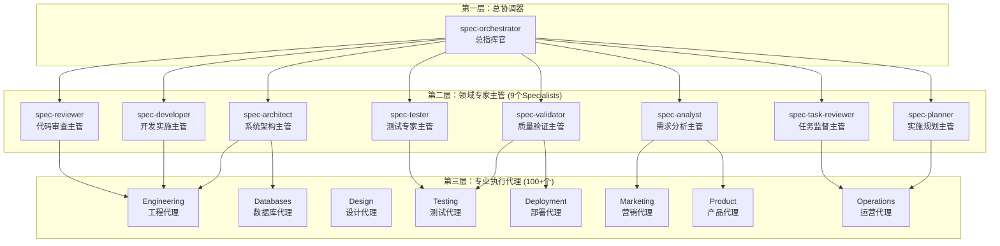
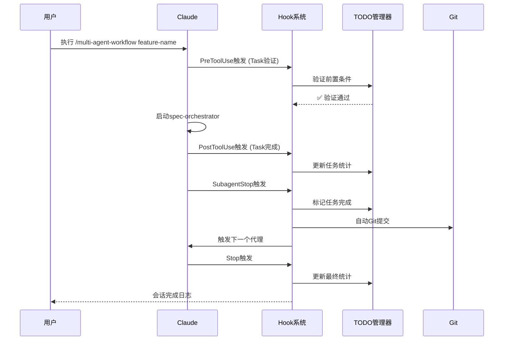

# 多层智能代理协调系统

> **Context Engineering 驱动的新一代AI编程助手生态系统**\
> 基于Claude Code构建的智能代理协调平台，实现从需求到交付的全流程自动化开发

[](https://opensource.org/licenses/MIT)
[](https://claude.ai)
[](https://github.com/coleam00/context-engineering-intro)

## 🎯 项目概述

这是一个基于ContextEngineering理念构建的多层智能代理协调系统，通过100+个专业AI代理（全汉化）的协作，实现从项目需求分析到最终交付的全自动化开发流程。系统采用三层架构设计，结合Hook驱动的自动化机制，能够智能地选择和协调不同专业领域的代理，确保高质量的软件交付。


### 🤔 为什么需要它？

你是否厌倦了反复编写和调试 `prompt`，却只能让AI完成零散的任务？`Claude-Code-Multi-Agent` 将这一切自动化！你只需提出需求，系统就能像一个全能的技术团队，协调100多位不同领域的AI专家（代理），自主完成需求分析、架构设计、编码、测试和交付。

- **Before**: `claude "请用 express 写一个返回 'hello world' 的服务器"` (得到一堆代码)
- **After**: `claude /agent-workflow "创建一个返回 'hello world' 的 Express 服务器"` (AI自主创建文件、写入代码、安装依赖、完成任务)

>在这期间一切都是**可控**的，每一个任务的节点都会提供及时反馈！


### 🧐 什么是上下文工程？

它代表了从传统“提示工程”到“系统化AI指导”的范式转变。

| 维度 | ❌ 提示工程 (Prompt Engineering) | ✅ **上下文工程 (Context Engineering)** |
| :--- | :--- | :--- |
| **范围** | 专注于巧妙的措辞和短语 | 提供包含背景信息的 **完整系统** |
| **内容** | 通常是单次任务的指令 | 包括文档、示例、规则、模式和验证 |
| **比喻** | 像是给AI一张 **便利贴** | 像是给AI一本包含所有细节的 **完整剧本** |
| **效果** | AI容易出错或偏离轨道 | AI能够自我纠正，实现复杂、可靠的端到端任务 |

**一言蔽之**：与其绞尽脑汁想一个完美的“提示”，不如为AI提供一个完美的“上下文环境”。这正是本项目正在做的事情。

---


## 🚀 快速上手 (5分钟入门)

只需四步，即可体验AI自动化编程的强大之处。

### 1. 环境准备

请确保你的电脑上已安装以下软件：

- [Claude Code](https://claude.ai/code) (核心平台)
- [Git](https://git-scm.com/)
- [Node.js (LTS)](https://nodejs.org/en/)


### 2. 下载并进入项目

打开终端，克隆本项目到本地。

```
git clone https://github.com/your-repo/Claude-Code-Multi-Agent.git
cd Claude-Code-Multi-Agent
```


### 3. 核心配置 (MCP)

> **这是什么？** MCP让AI代理拥有与外部世界交互的能力（如控制浏览器、长期记忆等）。这是实现真正自动化的关键。

请针对于您自己的系统，安装对应的MCP（除`mcp-feedback-enhanced`）其他非必需，MCP安装方法由于各系统各不相同，这里不过多赘述

### 🛠️ **核心MCP服务解析**

| MCP服务器                             | 主要功能                                                     |
| :------------------------------------ | :----------------------------------------------------------- |
| **`playwright-mcp`**                  | **浏览器自动化**: 授权代理通过Playwright控制浏览器，执行网页交互、端到端测试和数据抓取。 |
| **`memory`**                          | **长期记忆**: 提供一个持久化存储，让代理能够跨会话记住关键信息、上下文和用户偏好。 |
| **`sequential-thinking`**             | **顺序思维增强**: 引导代理进行更结构化、逻辑化的思考，将复杂问题分解为有序步骤。 |
| **`mcp-feedback-enhanced(交互核心)`** | **增强反馈循环**: 建立一个交互式反馈机制，允许用户在任务执行过程中进行干预和指导。 |
| **`browsermcp`**                      | **通用浏览器控制**: 提供一个轻量级的浏览器交互接口。         |
| **`shrimp-task-manager`**             | **任务管理**: 一个专用的任务管理服务，用于更精细地跟踪和控制自动化任务的执行状态。 |

> **注意**：
>
>   * 启用这些MCP服务可能需要在您的本地环境中安装相应的依赖，例如 **Node.js (用于 `npx`)** 和 **Python**。
>   * 部分服务如 `playwright-mcp` 在首次运行时会自动下载浏览器驱动，请确保您的网络连接正常。


### 4. 运行你的第一个自动化工作流！

现在，在 `Claude Code` 中打开本项目，并执行你的第一个指令：

```Bash
/agent-workflow "创建一个名为 app.js 的文件，并写入一个简单的 Express 服务器代码，监听3000端口，返回 'Hello, Multi-Agent!'"
```

恭喜！你已经成功启动了第一个AI工作流。观察AI如何像真人一样分析你的需求、创建文件、编写代码并报告任务完成

>**⚠️注意:**/agent-workflow还不是最强的命令执行流程，下方，我还会介绍更强的工作流命令


### ⚠️ **重要成本提醒**

**Token消耗极快：构建一个完整的项目从文档到成品，大约要使用$10美元的token**

这个系统在处理复杂项目时会消耗大量的Claude API token，特别是在以下场景：

- 多代理并行协作时的上下文传递
- 大型代码库的分析和重构
- 复杂架构设计的迭代优化
- 全面的测试套件生成和验证

建议在使用前：

1. 设置合理的token使用限制
2. 优先处理关键功能模块
3. 合理根据自身需求使用不同复杂度的工作流


🎯 核心使用场景

✨ **第一步：我该选择哪个工作流？(项目复杂度评估)**

面对不同任务，选择合适的工作流至关重要。如果你不确定任务的复杂度，可以让AI帮你分析！

**调用“总协调器” `@spec-orchestrator` 来获取建议**：

```bash
@spec-orchestrator 请帮我分析一下以下需求的复杂度，并推荐最合适的工作流。
我的需求是：“为我现有的Vue项目中添加一个带数据筛选和分页功能的表格组件。”
```

AI会分析你的需求，给出一个复杂度评分，并明确告诉你应该使用 `/agent-workflow` 还是 `/kiro/spec` 等指令。


✨ **场景一：在已有项目中添加新功能**

这是最常见的需求。流程如下：

将个人的项目移动至本仓库的根目录

**提出想法，生成规格**：使用 `/kiro/spec` 让AI为你规划

```bash
/kiro:spec "在我现有的CRM系统中，增加一个客户跟进记录模块。"
```

AI会生成需求、设计、任务列表等 `spec` 文件。

**（可选）微调规格**：你可以打开 `kiro/specs/` 目录下的文档，对AI的规划进行微调，确保它完全符合你的想法。

**启动开发**：让AI根据规划好的蓝图开始工作。

```bash
/agent-workflow "根据 kiro/specs/customer-follow-up-module.md 的规划，开始实现该功能。"
```


**场景二：从零开始一个新项目**

当你只有一个模糊的想法时，这个流程最适合。

```bash
/kiro/spec "我想做一个在线的Markdown笔记应用"
```

**执行蓝图**:

```bash
/multi-agent-workflow [/kiro/spec/markdown_app]   <- 直接粘贴文件路径或@文件
```


## 🏗️ 系统架构

### 三层代理架构



## 📂 核心Agent目录结构

```
# 目录结构
📦 agents                 # 顶层代理目录，包含所有不同类型的AI代理
    ├── 📄 auto-task-executor.js    # 自动任务执行器，用于自动化执行特定任务的脚本或配置
    ├── 📄 directory_tree.md        # 目录结构文档，描述整个代理目录的组织方式
    └── 📄 task-execution-agent.js  # 任务执行代理，负责接收并处理任务执行指令
    ├── 📂 bonus              # 额外代理目录，包含一些特殊或辅助性的代理
        ├── 📄 joker.md             # 小丑代理，可能用于生成幽默内容或进行非常规操作
        └── 📄 studio-coach.md      # 工作室教练代理，可能用于提供指导或培训
    ├── 📂 core               # 核心代理目录，包含提供基础或通用功能的代理
        ├── 📄 code-archaeologist.md  # 代码考古学家代理，用于分析和理解遗留代码
        ├── 📄 code-reviewer.md       # 代码审查代理，用于检查代码质量和发现潜在问题
        ├── 📄 documentation-specialist.md # 文档专家代理，用于生成和维护项目文档
        └── 📄 performance-optimizer.md # 性能优化器代理，用于分析和提升系统性能
    ├── 📂 databases          # 数据库代理目录，包含与数据库操作相关的代理
        ├── 📄 customer-support.md    # 客户支持代理，可能与用户数据或支持系统数据库交互
        ├── 📄 data-engineer.md       # 数据工程师代理，用于数据管道、ETL等操作
        ├── 📄 data-scientist.md      # 数据科学家代理，用于数据分析和模型训练
        ├── 📄 database-admin.md      # 数据库管理员代理，用于管理数据库操作和维护
        └── 📄 database-optimizer.md  # 数据库优化器代理，用于优化数据库查询和结构
    ├── 📂 deployment         # 部署代理目录，包含与软件部署和运维相关的代理
        ├── 📄 debugger.md            # 调试器代理，用于识别和修复代码中的错误
        ├── 📄 deployment-engineer.md # 部署工程师代理，负责自动化部署流程
        ├── 📄 devops-troubleshooter.md # DevOps 故障排除代理，用于诊断和解决运维问题
        ├── 📄 dx-optimizer.md        # 开发者体验优化代理，旨在提升开发效率和体验
        ├── 📄 error-detective.md     # 错误侦探代理，用于日志分析和错误模式识别
        ├── 📄 legacy-modernizer.md   # 遗留系统现代化代理，用于重构和升级旧系统
        ├── 📄 network-engineer.md    # 网络工程师代理，用于网络配置、故障排除和优化
        ├── 📄 payment-integration.md # 支付集成代理，用于处理支付系统相关的任务
        ├── 📄 performance-engineer.md # 性能工程师代理，用于应用性能优化和可伸缩性
        ├── 📄 prompt-engineer.md     # 提示工程师代理，用于设计和优化AI提示
        ├── 📄 quant-analyst.md       # 量化分析师代理，可能用于金融或数据量化分析
        ├── 📄 refactor-agent.md      # 重构代理，用于改进代码结构而不改变功能
        ├── 📄 risk-manager.md        # 风险管理器代理，用于识别、评估和缓解项目风险
        ├── 📄 sales-automator.md     # 销售自动化代理，用于自动化销售流程和营销活动
        ├── 📄 search-specialist.md   # 搜索专家代理，可能用于优化搜索功能或内容索引
        └── 📄 security-auditor.md    # 安全审计师代理，用于审查代码安全性和合规性
    ├── 📂 design             # 设计代理目录，包含与产品设计相关的代理
        ├── 📄 brand-guardian.md      # 品牌守护者代理，确保产品符合品牌指南
        ├── 📄 ui-designer.md         # UI 设计师代理，专注于用户界面视觉设计
        ├── 📄 ui-ux-master.md        # UI/UX 大师代理，提供全面的用户体验和界面设计
        ├── 📄 ux-researcher.md       # UX 研究员代理，专注于用户研究和需求分析
        ├── 📄 visual-storyteller.md  # 视觉故事讲述者代理，用于创建引人入胜的视觉叙事
        └── 📄 whimsy-injector.md     # 奇思妙想注入器代理，可能用于增加创意或趣味性元素
    ├── 📂 engineering        # 工程代理目录，包含通用工程领域的代理
        ├── 📂 backend            # 后端代理目录
            ├── 📄 ai-engineer.md         # AI 工程师代理，专注于AI模型和服务的后端实现
            ├── 📄 backend-architect.md   # 后端架构师代理，负责后端系统设计
            └── 📄 senior-backend-architect.md # 高级后端架构师代理，提供高级后端架构指导
        ├── 📂 frontend           # 前端代理目录
            ├── 📄 frontend-developer.md  # 前端开发代理，专注于前端代码实现
            ├── 📄 mobile-app-builder.md  # 移动应用构建器代理，用于开发移动应用程序
            ├── 📄 rapid-prototyper.md  # 快速原型开发代理，用于迅速构建功能原型
            └── 📄 senior-frontend-architect.md # 高级前端架构师代理，提供高级前端架构指导
        └── 📂 middlend           # 中间层代理目录，可能包含一些跨前后端的通用服务或工具
            ├── 📄 api-documenter.md      # API 文档编写代理，用于生成和维护API文档
            ├── 📄 architect-review.md    # 架构审查代理，用于评审系统架构
            ├── 📄 cloud-architect.md     # 云架构师代理，负责云平台架构设计和优化
            ├── 📄 code-reviewer.md       # 代码审查代理（通用，可能与 core/code-reviewer.md 功能重叠或更侧重于特定方面）
            └── 📄 devops-automator.md    # DevOps 自动化代理，用于自动化运维流程
    ├── 📂 marketing          # 市场营销代理目录，包含与市场推广相关的代理
        ├── 📄 app-store-optimizer.md # 应用商店优化代理，用于提升应用在应用商店的可见性
        ├── 📄 business-analyst.md    # 业务分析师代理，用于分析业务需求和市场趋势
        ├── 📄 content-creator.md     # 内容创作者代理，用于生成营销内容
        ├── 📄 growth-hacker.md       # 增长黑客代理，专注于通过实验和策略实现用户增长
        ├── 📄 instagram-curator.md   # Instagram 内容策展代理，用于管理和优化 Instagram 内容
        ├── 📄 reddit-community-builder.md # Reddit 社区建设代理，用于在 Reddit 上建立和管理社区
        ├── 📄 tiktok-strategist.md   # TikTok 策略师代理，用于制定和执行 TikTok 营销策略
        └── 📄 twitter-engager.md     # Twitter 互动代理，用于在 Twitter 上进行互动和内容发布
    ├── 📂 orchestrators      # 编排器代理目录，包含用于协调和管理其他代理的代理
        ├── 📄 context-manager.md     # 上下文管理器代理，用于管理和维护会话或项目上下文
        ├── 📄 project-analyst.md     # 项目分析师代理，用于对项目进行初始分析和评估
        ├── 📄 team-configurator.md   # 团队配置器代理，用于设置和管理代理团队
        └── 📄 tech-lead-orchestrator.md # 技术主管编排器代理，作为高级协调者管理整个开发流程
    ├── 📂 product            # 产品代理目录，包含与产品管理相关的代理
        ├── 📄 feedback-synthesizer.md # 反馈合成器代理，用于收集和分析用户反馈
        ├── 📄 sprint-prioritizer.md  # Sprint 优先级排序代理，用于确定开发迭代中的任务优先级
        └── 📄 trend-researcher.md    # 趋势研究员代理，用于分析市场趋势和用户行为
    ├── 📂 project-management # 项目管理代理目录，包含与项目管理相关的代理
        ├── 📄 experiment-tracker.md  # 实验跟踪器代理，用于跟踪和分析实验结果
        ├── 📄 project-shipper.md     # 项目发布代理，负责项目的最终交付和发布
        └── 📄 studio-producer.md     # 工作室制作人代理，可能用于协调多媒体或内容制作项目
    ├── 📂 specialist         # 专家代理目录，包含一些在特定领域具有深度专业知识的代理
        ├── 📄 spec-analyst.md        # 规范分析师代理，用于需求获取和规范文档编写
        ├── 📄 spec-architect.md      # 规范架构师代理，根据规范进行系统架构设计
        ├── 📄 spec-developer.md      # 规范开发代理，根据详细规范进行代码实现
        ├── 📄 spec-orchestrator.md   # 规范编排器代理，协调基于规范的开发流程
        ├── 📄 spec-planner.md        # 规范规划代理，将设计分解为可执行任务
        ├── 📄 spec-reviewer.md       # 规范审查代理，审查代码和设计是否符合规范
        ├── 📄 spec-task-reviewer.md  # 规范任务审查代理，验证开发任务的完成情况
        ├── 📄 spec-tester.md         # 规范测试代理，创建和执行测试套件以验证规范
        └── 📄 spec-validator.md      # 规范验证代理，进行最终质量验证以确保符合所有规范和生产就绪
    ├── 📂 specialized        # 专业化代理目录，包含按编程语言的框架....在这里可以添加您的编程语言规范，这里仅提供了一些模板
        ├── 📂 C++                # C++ 语言专家代理
            └── 📄 cpp-pro.md           # C++ 编程专家代理
        ├── 📂 databases          # 数据库专业代理 (可能与顶层 databases 目录下的代理功能互补)
            └── 📄 sql-pro.md           # SQL 编程和优化专家代理
        ├── 📂 django             # Django 框架专家代理
            ├── 📄 django-api-developer.md # Django API 开发代理
            ├── 📄 django-backend-expert.md # Django 后端专家代理
            └── 📄 django-orm-expert.md # Django ORM 专家代理
        ├── 📂 Golang             # Go 语言专家代理
            └── 📄 golang-pro.md        # Go 语言编程专家代理
        ├── 📂 JavaScript         # JavaScript 语言专家代理
            └── 📄 javascript-pro.md    # JavaScript 编程专家代理
        ├── 📂 laravel            # Laravel 框架专家代理
            ├── 📄 laravel-backend-expert.md # Laravel 后端专家代理
            └── 📄 laravel-eloquent-expert.md # Laravel Eloquent ORM 专家代理
        ├── 📂 Python             # Python 语言专家代理
            └── 📄 python-pro.md        # Python 编程专家代理
        ├── 📂 rails              # Ruby on Rails 框架专家代理
            ├── 📄 rails-activerecord-expert.md # Rails ActiveRecord 专家代理
            ├── 📄 rails-api-developer.md # Rails API 开发代理
            └── 📄 rails-backend-expert.md # Rails 后端专家代理
        ├── 📂 react              # React 框架专家代理
            ├── 📄 react-component-architect.md # React 组件架构师代理
            └── 📄 react-nextjs-expert.md # React Next.js 专家代理
        └── 📂 vue                # Vue.js 框架专家代理
            ├── 📄 vue-component-architect.md # Vue 组件架构师代理
            ├── 📄 vue-nuxt-expert.md   # Vue Nuxt.js 专家代理
            └── 📄 vue-state-manager.md # Vue 状态管理专家代理
    ├── 📂 studio-operations  # 工作室运营代理目录，包含与日常运营相关的代理
        ├── 📄 analytics-reporter.md  # 分析报告代理，用于生成数据分析报告
        ├── 📄 finance-tracker.md     # 财务跟踪代理，用于管理和跟踪财务数据
        ├── 📄 infrastructure-maintainer.md # 基础设施维护代理，用于维护IT基础设施
        ├── 📄 legal-compliance-checker.md # 法律合规性检查代理，确保符合法律法规
        └── 📄 support-responder.md   # 支持响应代理，用于处理用户支持请求
    ├── 📂 testing            # 测试代理目录，包含与软件测试相关的代理
        ├── 📄 api-tester.md          # API 测试代理，专注于API接口测试
        ├── 📄 integration-test-fixer.md # 集成测试修复代理，用于修复集成测试中发现的问题
        ├── 📄 performance-benchmarker.md # 性能基准测试代理，用于设定和执行性能基准测试
        ├── 📄 test-automator.md      # 测试自动化代理，用于创建和管理自动化测试
        ├── 📄 test-results-analyzer.md # 测试结果分析代理，用于分析测试报告
        ├── 📄 test-writer-fixer.md   # 测试编写和修复代理，用于编写和修复测试用例
        ├── 📄 tool-evaluator.md      # 工具评估代理，用于评估和选择开发工具
        └── 📄 workflow-optimizer.md  # 工作流优化代理，用于优化开发和测试流程
    └── 📂 universal          # 通用代理目录，包含不特定于某个技术栈的通用代理
        ├── 📄 api-architect.md       # API 架构师代理，设计通用API结构
        ├── 📄 backend-developer.md   # 后端开发代理（通用）
        ├── 📄 frontend-developer.md  # 前端开发代理（通用）
        └── 📄 tailwind-css-expert.md # Tailwind CSS 专家代理，专注于CSS框架
```


### 🧩 上下文工程的核心组件

一个优秀的上下文环境由以下几个关键部分组成，这套模板也体现了这些思想：

* `CLAUDE.md`: **全局规则手册**。这是AI在项目中必须遵守的最高行为准则，比如代码风格、测试要求、文件结构等。
* `examples/` 或 `agents/`: **最佳实践案例库**。AI通过学习这些示例代码来理解您的项目模式和架构风格。**在本工程中，庞大的 `agents/` 目录本身就是AI学习和模仿的最佳案例库**。
* `INITIAL.md`: **初始需求描述**。这是您对一个功能的初步想法和要求。**在本工程中，这对应于您提供给 `/kiro/spec` 或 `/agent-workflow` 指令的初始文字描述**。
* `PRPs/` (产品需求提示): **综合性实施蓝图**。这是一个由AI生成的、极其详细的技术实现方案，包含了上下文、步骤、验证等。**在本工程中，这对应于 `/kiro/spec` 指令所生成的系列规格文档，您可以根据自身公司的需求或您想要的模板进行汉化或是调整**

---

### 🚀 核心工作流：从想法到实现

上下文工程将软件开发流程化、自动化。以下是标准流程，它与您使用本项目指令的流程高度一致。

#### **第1步：定义全局规则 (编辑 `CLAUDE.md`)**

这是您为整个项目设定的“法律”。一个好的 `CLAUDE.md` 文件应包含：
* **项目意识**：要求AI在行动前先阅读规划文档、检查现有代码。
* **代码规范**：如文件大小限制、模块化组织方式。
* **测试要求**：如单元测试的风格、代码覆盖率目标。
* **文档标准**：如注释和文档字符串的格式。

> 您可以根据您的团队规范，自由定制此文件。

#### **第2步：创建初始功能请求**
这是您与AI协作的起点。一个高质量的初始请求应包含：
* **功能描述**：明确、具体地描述您想构建什么。
    * `❌ 坏例子`: “构建一个爬虫”
    * `✅ 好例子`: “构建一个使用 `BeautifulSoup` 的异步网络爬虫，用于抓取电商网站的产品数据，能处理速率限制，并将结果存入PostgreSQL数据库。”
* **代码示例**：告诉AI应该参考哪些现有代码模式。
* **相关文档**：提供API文档链接、数据库结构图等。
* **其他考量**：提及任何特殊要求、常见的坑或性能指标。

#### **第3步：生成实施蓝图 (PRP)**

拿到您的初始请求后，AI会进入研究和规划阶段。
* **对应指令**：**这对应于本项目的 `/kiro/spec` 或 `/generate-prp` 指令。**

这个过程会：
1.  **研究分析**: AI会分析您的代码库、寻找相似实现、确认代码惯例。
2.  **整合文档**: AI会抓取您提供的链接中的关键信息。
3.  **创建蓝图**: AI会生成一份详细的、带验证步骤的实施计划（即PRP或规格文档），并存放在 `PRPs/` 或 `kiro/specs/` 目录下。

#### **第4步：执行蓝图**
万事俱备，现在让AI开始编码。
* **对应指令**：**这对应于本项目的 `/agent-workflow` 或 `/execute-prp` 指令。**

AI会严格按照蓝图执行：
1.  **加载上下文**: 读取完整的PRP蓝图。
2.  **制定计划**: 创建详细的子任务列表。
3.  **执行与验证**: 实现每个功能点，并运行测试或验证命令来确保正确性。
4.  **迭代修复**: 如果验证失败，AI会尝试自我修复，直到所有检查通过。
5.  **完成任务**: 确保所有成功标准都已满足。

---

### ⭐ 最佳实践

1.  **初始请求要明确**
    不要假设AI懂你。明确提出你的要求、限制和偏好，并大量引用 `examples/` 或 `agents/` 中的案例。

2.  **提供全面的示例**
    案例库是AI学习的食粮。提供越多的高质量示例，AI生成的代码就越符合你的期望。不仅要展示“做什么”，有时也要展示“不做什么”（如错误处理模式）。

3.  **利用验证关卡**
    在你的实现蓝图（PRP）中可以包含必须通过的测试命令或lint检查。这会强制AI进行自我修正，确保它一次性交付可用的代码。

4.  **善用外部文档**
    不要吝啬提供API文档、库指南或相关的Stack Overflow链接。你提供的信息越多，AI就越不需要去“猜测”。

5.  **不断完善 `CLAUDE.md`**
    每当AI犯了一个你不想让它再犯的错误时，就考虑将相关的规则添加到 `CLAUDE.md` 中。这是一个持续进化的过程。


## 🔧 核心指令系统

> 📖 **详细使用指南**：查看 [工作流指令使用指南](docs/workflow-guide.md) 了解四个核心指令的关系、使用场景和选择策略

### 🚀 主要工作流指令

#### 1. `/generate-prp` - PRP需求文档生成

**用途**：基于初步需求生成详细的产品需求提示文档

```bash
/generate-prp INITIAL.md
```

**功能**：

- 深度分析功能需求
- 研究技术实现方案
- 生成全面的PRP文档
- 包含验证循环和质量标准

#### 2. `/execute-prp` - PRP执行工作流

**用途**：根据PRP文档自动实现功能

```bash
/execute-prp PRPs/your-feature-name.md
```

**功能**：

- 解析PRP需求和规范
- 创建详细实施计划
- 逐步执行代码实现
- 运行验证和测试

#### 3. `/agent-workflow` - 中等难度自动化工作流

**用途**：处理中等复杂度的功能开发

```bash
/agent-workflow <功能描述>
```

**执行流程**：

```
spec-analyst → spec-architect → spec-developer → spec-validator → spec-tester
     ↓              ↓              ↓              ↓              ↓
  需求分析        系统架构        代码实现        质量验证        测试验证
```

**质量门控**：达到95%质量分数才继续下一阶段

#### 4. `/multi-agent-workflow` - 高难度复杂重构工作流

**用途**：处理复杂的系统重构和大型功能开发

```bash
/multi-agent-workflow <功能名称>
```

**三层协调架构**：

1. **spec-orchestrator** - 总协调，智能选择代理团队
2. **9个specialist主管** - 领域专家协调和管理
3. **100+专业代理** - 具体任务执行

### 🎯 Kiro工作流指令

#### 5. `/kiro/spec` - 完整规格创建流程

**用途**：从粗略想法到完整实施规格的迭代流程

```bash
/kiro:spec <功能想法>
```

**三阶段流程**：

1. **需求收集** - 生成需求文档并与用户迭代确认
2. **设计创建** - 基于需求进行技术设计和架构规划
3. **任务列表** - 将设计分解为可执行的编程任务

#### 6. `/kiro/execute` - 任务执行

**用途**：执行Kiro规格中的具体任务

```bash
/kiro:execute <功能名称> <任务描述>
```

### 🧠 思考和分析指令

#### 7. `/think-ultra` - 超级思考模式

**用途**：处理复杂问题的深度分析和解决方案设计

```bash
/think-ultra <复杂问题描述>
```

#### 8. `/reflection` - 反思和优化

**用途**：对已完成工作进行反思和改进建议

```bash
/reflection <要反思的内容>
```

#### 9. `/eureka` - 技术突破记录

**用途**：记录和文档化技术突破和创新解决方案

```bash
/eureka <突破描述>
```

### 🔧 工具和辅助指令

#### 10. `/gh/fix-issue` - GitHub问题修复

**用途**：自动化GitHub问题分析和修复流程

```bash
/gh:fix-issue <issue-number>
```

#### 11. `/gh/review-pr` - PR审查

**用途**：代码审查和PR反馈

```bash
/gh:review-pr <pr-number>
```

#### 12. `/cc/create-command` - 创建新指令

**用途**：创建自定义Claude Code指令

```bash
/cc:create-command <指令名称> <描述>
```

## 🔗 Hook自动化机制

Hook系统实现了基于事件的自动化流程，配置在 `.claude/settings.local.json` 中：

### Hook事件类型

#### 1. **PreToolUse** - 工具使用前触发

```json
{
    "matcher": "Task",
    "hooks": [{
        "type": "command",
        "command": "node agents/todo-hook-manager.js validate-task-prerequisites",
        "timeout": 10000
    }]
}
```

**触发场景**：代理任务启动前的前置条件验证

#### 2. **PostToolUse** - 工具使用后触发

```json
{
    "matcher": "Edit|MultiEdit|Write",
    "hooks": [{
        "type": "command",
        "command": "node agents/todo-hook-manager.js handle-file-change",
        "timeout": 30000
    }]
}
```

**触发场景**：文件编辑完成后的状态更新和任务标记

#### 3. **SubagentStop** - 子代理停止时触发

```json
{
    "matcher": "*",
    "hooks": [
        {
            "command": "node agents/todo-hook-manager.js handle-task-complete",
            "timeout": 45000
        },
        {
            "command": "git add . && git commit -m \"Auto-commit: Agent task completed - $(date)\" || true",
            "timeout": 20000
        }
    ]
}
```

**触发场景**：代理任务完成后的自动提交和下一任务触发

#### 4. **Notification** - 通知事件

```json
{
    "matcher": "",
    "hooks": [{
        "command": "node agents/todo-hook-manager.js handle-notification",
        "timeout": 10000
    }]
}
```

#### 5. **Stop** - Claude响应完成

```json
{
    "matcher": "",
    "hooks": [
        {
            "command": "node agents/todo-hook-manager.js update-stats",
            "timeout": 15000
        },
        {
            "command": "echo \"$(date): Claude Code session completed\" >> .claude/session.log",
            "timeout": 5000
        }
    ]
}
```

### Hook自动化流程示例



## 🎯 核心九大专家代理

### 1. 📋 spec-orchestrator - 总协调器

**职责**：多层智能代理协调系统的总指挥官

- 读取Kiro规格文件进行深度分析
- 智能选择最合适的专业代理团队
- 协调三层架构的代理执行
- 管理统一的TODO任务列表
- 实现Hook驱动的自动化流程

### 2. 📊 spec-analyst - 需求分析师

**职责**：需求获取和项目范围专家

- 获取全面的需求和用户故事
- 创建带验收标准的结构化需求文档
- 分析利益相关者和用户画像
- 生成项目简报和范围文档

### 3. 🏗️ spec-architect - 系统架构师

**职责**：技术设计和架构专家

- 创建全面的系统设计和架构
- 技术栈推荐和评估
- API规范和数据模型设计
- 确保可扩展性、安全性和可维护性

### 4. 📝 spec-planner - 实施规划师

**职责**：将架构设计分解为可操作任务

- 创建详细的任务列表和实现顺序
- 估算复杂性和工作量
- 定义实现顺序和依赖关系
- 规划全面的测试策略

### 5. 💻 spec-developer - 开发专家

**职责**：根据规范实现代码

- 编写干净、可维护的生产质量代码
- 遵循架构模式和最佳实践
- 创建单元测试和处理错误场景
- 确保与现有代码的无缝集成

### 6. 🔍 spec-reviewer - 代码审查师

**职责**：代码质量和最佳实践保证

- 评估代码可读性和可维护性
- 识别安全漏洞和性能瓶颈
- 检查代码异味和反模式
- 提供可操作的改进反馈

### 7. ✅ spec-validator - 质量验证师

**职责**：最终质量验证和生产就绪评估

- 验证所有需求是否满足
- 确认架构实现的正确性
- 计算整体质量分数
- 生成全面的验证报告

### 8. 🧪 spec-tester - 测试专家

**职责**：综合测试策略和实现

- 创建并执行全面的测试套件
- 编写单元、集成和端到端测试
- 执行安全测试和性能测试
- 确保代码覆盖率符合标准

### 9. 📋 spec-task-reviewer - 任务监督师

**职责**：开发任务完成状态审查

- 系统地审查任务列表中的每个任务
- 验证实现是否符合规范要求
- 自动触发未完成任务的执行
- 提供全面的进度状态报告


## 📄 许可证

本项目采用 MIT 许可证 - 详见 [LICENSE](LICENSE) 文件

## 🙏 致谢

- [Context Engineering Intro](https://github.com/coleam00/context-engineering-intro) -
  核心理念来源
- [Claude Code](https://claude.ai) - 强大的AI开发平台
- 所有贡献者和社区成员

---

**让AI真正成为你的开发伙伴，而不仅仅是工具** 🚀