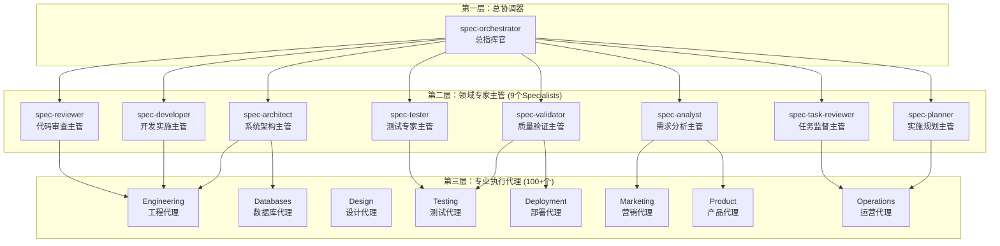
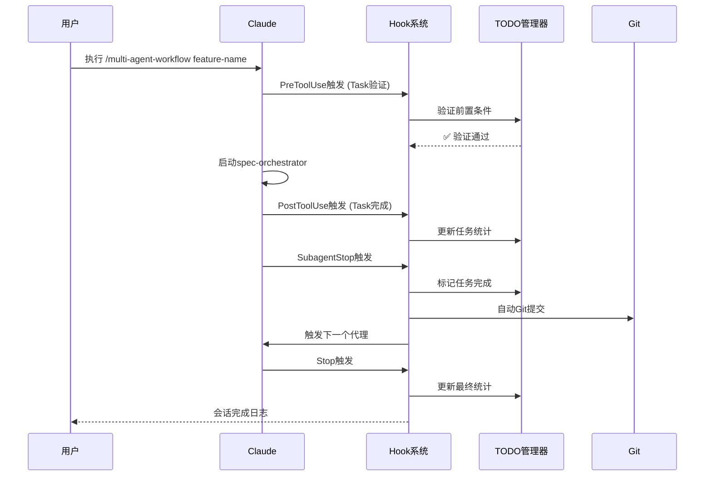

> **Context Engineering 驱动的新一代AI编程助手生态系统**\
> 基于Claude Code构建的智能代理协调平台，实现从需求到交付的全流程自动化开发

[](https://opensource.org/licenses/MIT)
[](https://claude.ai)
[](https://github.com/coleam00/context-engineering-intro)

## 🎯 项目概述

这是一个基于ContextEngineering理念构建的多层智能代理协调系统，通过100+个专业AI代理（全汉化）的协作，实现从项目需求分析到最终交付的全自动化开发流程。系统采用三层架构设计，结合Hook驱动的自动化机制，能够智能地选择和协调不同专业领域的代理，确保高质量的软件交付。

### ⚠️ **重要成本提醒**

**Token消耗极快：构建一个完整的项目从文档到成品，大约要使用$10美元的token**

这个系统在处理复杂项目时会消耗大量的Claude API token，特别是在以下场景：

- 多代理并行协作时的上下文传递
- 大型代码库的分析和重构
- 复杂架构设计的迭代优化
- 全面的测试套件生成和验证

建议在使用前：

1. 设置合理的token使用限制
2. 优先处理关键功能模块
3. 合理根据自身需求使用不同复杂度的工作流


## 🏗️ 系统架构

### 三层代理架构



## 📂 目录结构

```
# 目录结构
📦 agents                 # 顶层代理目录，包含所有不同类型的AI代理
    ├── 📄 auto-task-executor.js    # 自动任务执行器，用于自动化执行特定任务的脚本或配置
    ├── 📄 directory_tree.md        # 目录结构文档，描述整个代理目录的组织方式
    └── 📄 task-execution-agent.js  # 任务执行代理，负责接收并处理任务执行指令
    ├── 📂 bonus              # 额外代理目录，包含一些特殊或辅助性的代理
        ├── 📄 joker.md             # 小丑代理，可能用于生成幽默内容或进行非常规操作
        └── 📄 studio-coach.md      # 工作室教练代理，可能用于提供指导或培训
    ├── 📂 core               # 核心代理目录，包含提供基础或通用功能的代理
        ├── 📄 code-archaeologist.md  # 代码考古学家代理，用于分析和理解遗留代码
        ├── 📄 code-reviewer.md       # 代码审查代理，用于检查代码质量和发现潜在问题
        ├── 📄 documentation-specialist.md # 文档专家代理，用于生成和维护项目文档
        └── 📄 performance-optimizer.md # 性能优化器代理，用于分析和提升系统性能
    ├── 📂 databases          # 数据库代理目录，包含与数据库操作相关的代理
        ├── 📄 customer-support.md    # 客户支持代理，可能与用户数据或支持系统数据库交互
        ├── 📄 data-engineer.md       # 数据工程师代理，用于数据管道、ETL等操作
        ├── 📄 data-scientist.md      # 数据科学家代理，用于数据分析和模型训练
        ├── 📄 database-admin.md      # 数据库管理员代理，用于管理数据库操作和维护
        └── 📄 database-optimizer.md  # 数据库优化器代理，用于优化数据库查询和结构
    ├── 📂 deployment         # 部署代理目录，包含与软件部署和运维相关的代理
        ├── 📄 debugger.md            # 调试器代理，用于识别和修复代码中的错误
        ├── 📄 deployment-engineer.md # 部署工程师代理，负责自动化部署流程
        ├── 📄 devops-troubleshooter.md # DevOps 故障排除代理，用于诊断和解决运维问题
        ├── 📄 dx-optimizer.md        # 开发者体验优化代理，旨在提升开发效率和体验
        ├── 📄 error-detective.md     # 错误侦探代理，用于日志分析和错误模式识别
        ├── 📄 legacy-modernizer.md   # 遗留系统现代化代理，用于重构和升级旧系统
        ├── 📄 network-engineer.md    # 网络工程师代理，用于网络配置、故障排除和优化
        ├── 📄 payment-integration.md # 支付集成代理，用于处理支付系统相关的任务
        ├── 📄 performance-engineer.md # 性能工程师代理，用于应用性能优化和可伸缩性
        ├── 📄 prompt-engineer.md     # 提示工程师代理，用于设计和优化AI提示
        ├── 📄 quant-analyst.md       # 量化分析师代理，可能用于金融或数据量化分析
        ├── 📄 refactor-agent.md      # 重构代理，用于改进代码结构而不改变功能
        ├── 📄 risk-manager.md        # 风险管理器代理，用于识别、评估和缓解项目风险
        ├── 📄 sales-automator.md     # 销售自动化代理，用于自动化销售流程和营销活动
        ├── 📄 search-specialist.md   # 搜索专家代理，可能用于优化搜索功能或内容索引
        └── 📄 security-auditor.md    # 安全审计师代理，用于审查代码安全性和合规性
    ├── 📂 design             # 设计代理目录，包含与产品设计相关的代理
        ├── 📄 brand-guardian.md      # 品牌守护者代理，确保产品符合品牌指南
        ├── 📄 ui-designer.md         # UI 设计师代理，专注于用户界面视觉设计
        ├── 📄 ui-ux-master.md        # UI/UX 大师代理，提供全面的用户体验和界面设计
        ├── 📄 ux-researcher.md       # UX 研究员代理，专注于用户研究和需求分析
        ├── 📄 visual-storyteller.md  # 视觉故事讲述者代理，用于创建引人入胜的视觉叙事
        └── 📄 whimsy-injector.md     # 奇思妙想注入器代理，可能用于增加创意或趣味性元素
    ├── 📂 engineering        # 工程代理目录，包含通用工程领域的代理
        ├── 📂 backend            # 后端代理目录
            ├── 📄 ai-engineer.md         # AI 工程师代理，专注于AI模型和服务的后端实现
            ├── 📄 backend-architect.md   # 后端架构师代理，负责后端系统设计
            └── 📄 senior-backend-architect.md # 高级后端架构师代理，提供高级后端架构指导
        ├── 📂 frontend           # 前端代理目录
            ├── 📄 frontend-developer.md  # 前端开发代理，专注于前端代码实现
            ├── 📄 mobile-app-builder.md  # 移动应用构建器代理，用于开发移动应用程序
            ├── 📄 rapid-prototyper.md  # 快速原型开发代理，用于迅速构建功能原型
            └── 📄 senior-frontend-architect.md # 高级前端架构师代理，提供高级前端架构指导
        └── 📂 middlend           # 中间层代理目录，可能包含一些跨前后端的通用服务或工具
            ├── 📄 api-documenter.md      # API 文档编写代理，用于生成和维护API文档
            ├── 📄 architect-review.md    # 架构审查代理，用于评审系统架构
            ├── 📄 cloud-architect.md     # 云架构师代理，负责云平台架构设计和优化
            ├── 📄 code-reviewer.md       # 代码审查代理（通用，可能与 core/code-reviewer.md 功能重叠或更侧重于特定方面）
            └── 📄 devops-automator.md    # DevOps 自动化代理，用于自动化运维流程
    ├── 📂 marketing          # 市场营销代理目录，包含与市场推广相关的代理
        ├── 📄 app-store-optimizer.md # 应用商店优化代理，用于提升应用在应用商店的可见性
        ├── 📄 business-analyst.md    # 业务分析师代理，用于分析业务需求和市场趋势
        ├── 📄 content-creator.md     # 内容创作者代理，用于生成营销内容
        ├── 📄 growth-hacker.md       # 增长黑客代理，专注于通过实验和策略实现用户增长
        ├── 📄 instagram-curator.md   # Instagram 内容策展代理，用于管理和优化 Instagram 内容
        ├── 📄 reddit-community-builder.md # Reddit 社区建设代理，用于在 Reddit 上建立和管理社区
        ├── 📄 tiktok-strategist.md   # TikTok 策略师代理，用于制定和执行 TikTok 营销策略
        └── 📄 twitter-engager.md     # Twitter 互动代理，用于在 Twitter 上进行互动和内容发布
    ├── 📂 orchestrators      # 编排器代理目录，包含用于协调和管理其他代理的代理
        ├── 📄 context-manager.md     # 上下文管理器代理，用于管理和维护会话或项目上下文
        ├── 📄 project-analyst.md     # 项目分析师代理，用于对项目进行初始分析和评估
        ├── 📄 team-configurator.md   # 团队配置器代理，用于设置和管理代理团队
        └── 📄 tech-lead-orchestrator.md # 技术主管编排器代理，作为高级协调者管理整个开发流程
    ├── 📂 product            # 产品代理目录，包含与产品管理相关的代理
        ├── 📄 feedback-synthesizer.md # 反馈合成器代理，用于收集和分析用户反馈
        ├── 📄 sprint-prioritizer.md  # Sprint 优先级排序代理，用于确定开发迭代中的任务优先级
        └── 📄 trend-researcher.md    # 趋势研究员代理，用于分析市场趋势和用户行为
    ├── 📂 project-management # 项目管理代理目录，包含与项目管理相关的代理
        ├── 📄 experiment-tracker.md  # 实验跟踪器代理，用于跟踪和分析实验结果
        ├── 📄 project-shipper.md     # 项目发布代理，负责项目的最终交付和发布
        └── 📄 studio-producer.md     # 工作室制作人代理，可能用于协调多媒体或内容制作项目
    ├── 📂 specialist         # 专家代理目录，包含一些在特定领域具有深度专业知识的代理
        ├── 📄 spec-analyst.md        # 规范分析师代理，用于需求获取和规范文档编写
        ├── 📄 spec-architect.md      # 规范架构师代理，根据规范进行系统架构设计
        ├── 📄 spec-developer.md      # 规范开发代理，根据详细规范进行代码实现
        ├── 📄 spec-orchestrator.md   # 规范编排器代理，协调基于规范的开发流程
        ├── 📄 spec-planner.md        # 规范规划代理，将设计分解为可执行任务
        ├── 📄 spec-reviewer.md       # 规范审查代理，审查代码和设计是否符合规范
        ├── 📄 spec-task-reviewer.md  # 规范任务审查代理，验证开发任务的完成情况
        ├── 📄 spec-tester.md         # 规范测试代理，创建和执行测试套件以验证规范
        └── 📄 spec-validator.md      # 规范验证代理，进行最终质量验证以确保符合所有规范和生产就绪
    ├── 📂 specialized        # 专业化代理目录，包含按编程语言的框架....在这里可以添加您的编程语言规范，这里仅提供了一些模板
        ├── 📂 C++                # C++ 语言专家代理
            └── 📄 cpp-pro.md           # C++ 编程专家代理
        ├── 📂 databases          # 数据库专业代理 (可能与顶层 databases 目录下的代理功能互补)
            └── 📄 sql-pro.md           # SQL 编程和优化专家代理
        ├── 📂 django             # Django 框架专家代理
            ├── 📄 django-api-developer.md # Django API 开发代理
            ├── 📄 django-backend-expert.md # Django 后端专家代理
            └── 📄 django-orm-expert.md # Django ORM 专家代理
        ├── 📂 Golang             # Go 语言专家代理
            └── 📄 golang-pro.md        # Go 语言编程专家代理
        ├── 📂 JavaScript         # JavaScript 语言专家代理
            └── 📄 javascript-pro.md    # JavaScript 编程专家代理
        ├── 📂 laravel            # Laravel 框架专家代理
            ├── 📄 laravel-backend-expert.md # Laravel 后端专家代理
            └── 📄 laravel-eloquent-expert.md # Laravel Eloquent ORM 专家代理
        ├── 📂 Python             # Python 语言专家代理
            └── 📄 python-pro.md        # Python 编程专家代理
        ├── 📂 rails              # Ruby on Rails 框架专家代理
            ├── 📄 rails-activerecord-expert.md # Rails ActiveRecord 专家代理
            ├── 📄 rails-api-developer.md # Rails API 开发代理
            └── 📄 rails-backend-expert.md # Rails 后端专家代理
        ├── 📂 react              # React 框架专家代理
            ├── 📄 react-component-architect.md # React 组件架构师代理
            └── 📄 react-nextjs-expert.md # React Next.js 专家代理
        └── 📂 vue                # Vue.js 框架专家代理
            ├── 📄 vue-component-architect.md # Vue 组件架构师代理
            ├── 📄 vue-nuxt-expert.md   # Vue Nuxt.js 专家代理
            └── 📄 vue-state-manager.md # Vue 状态管理专家代理
    ├── 📂 studio-operations  # 工作室运营代理目录，包含与日常运营相关的代理
        ├── 📄 analytics-reporter.md  # 分析报告代理，用于生成数据分析报告
        ├── 📄 finance-tracker.md     # 财务跟踪代理，用于管理和跟踪财务数据
        ├── 📄 infrastructure-maintainer.md # 基础设施维护代理，用于维护IT基础设施
        ├── 📄 legal-compliance-checker.md # 法律合规性检查代理，确保符合法律法规
        └── 📄 support-responder.md   # 支持响应代理，用于处理用户支持请求
    ├── 📂 testing            # 测试代理目录，包含与软件测试相关的代理
        ├── 📄 api-tester.md          # API 测试代理，专注于API接口测试
        ├── 📄 integration-test-fixer.md # 集成测试修复代理，用于修复集成测试中发现的问题
        ├── 📄 performance-benchmarker.md # 性能基准测试代理，用于设定和执行性能基准测试
        ├── 📄 test-automator.md      # 测试自动化代理，用于创建和管理自动化测试
        ├── 📄 test-results-analyzer.md # 测试结果分析代理，用于分析测试报告
        ├── 📄 test-writer-fixer.md   # 测试编写和修复代理，用于编写和修复测试用例
        ├── 📄 tool-evaluator.md      # 工具评估代理，用于评估和选择开发工具
        └── 📄 workflow-optimizer.md  # 工作流优化代理，用于优化开发和测试流程
    └── 📂 universal          # 通用代理目录，包含不特定于某个技术栈的通用代理
        ├── 📄 api-architect.md       # API 架构师代理，设计通用API结构
        ├── 📄 backend-developer.md   # 后端开发代理（通用）
        ├── 📄 frontend-developer.md  # 前端开发代理（通用）
        └── 📄 tailwind-css-expert.md # Tailwind CSS 专家代理，专注于CSS框架
```

## 🔧 核心指令系统

### 🚀 主要工作流指令

#### 1. `/generate-prp` - PRP需求文档生成

**用途**：基于初步需求生成详细的产品需求提示文档

```bash
/generate-prp INITIAL.md
```

**功能**：

- 深度分析功能需求
- 研究技术实现方案
- 生成全面的PRP文档
- 包含验证循环和质量标准

#### 2. `/execute-prp` - PRP执行工作流

**用途**：根据PRP文档自动实现功能

```bash
/execute-prp PRPs/your-feature-name.md
```

**功能**：

- 解析PRP需求和规范
- 创建详细实施计划
- 逐步执行代码实现
- 运行验证和测试

#### 3. `/agent-workflow` - 中等难度自动化工作流

**用途**：处理中等复杂度的功能开发

```bash
/agent-workflow <功能描述>
```

**执行流程**：

```
spec-analyst → spec-architect → spec-developer → spec-validator → spec-tester
     ↓              ↓              ↓              ↓              ↓
  需求分析        系统架构        代码实现        质量验证        测试验证
```

**质量门控**：达到95%质量分数才继续下一阶段

#### 4. `/multi-agent-workflow` - 高难度复杂重构工作流

**用途**：处理复杂的系统重构和大型功能开发

```bash
/multi-agent-workflow <功能名称>
```

**三层协调架构**：

1. **spec-orchestrator** - 总协调，智能选择代理团队
2. **9个specialist主管** - 领域专家协调和管理
3. **100+专业代理** - 具体任务执行

### 🎯 Kiro工作流指令

#### 5. `/kiro/spec` - 完整规格创建流程

**用途**：从粗略想法到完整实施规格的迭代流程

```bash
/kiro:spec <功能想法>
```

**三阶段流程**：

1. **需求收集** - 生成需求文档并与用户迭代确认
2. **设计创建** - 基于需求进行技术设计和架构规划
3. **任务列表** - 将设计分解为可执行的编程任务

#### 6. `/kiro/execute` - 任务执行

**用途**：执行Kiro规格中的具体任务

```bash
/kiro:execute <功能名称> <任务描述>
```

### 🧠 思考和分析指令

#### 7. `/think-ultra` - 超级思考模式

**用途**：处理复杂问题的深度分析和解决方案设计

```bash
/think-ultra <复杂问题描述>
```

#### 8. `/reflection` - 反思和优化

**用途**：对已完成工作进行反思和改进建议

```bash
/reflection <要反思的内容>
```

#### 9. `/eureka` - 技术突破记录

**用途**：记录和文档化技术突破和创新解决方案

```bash
/eureka <突破描述>
```

### 🔧 工具和辅助指令

#### 10. `/gh/fix-issue` - GitHub问题修复

**用途**：自动化GitHub问题分析和修复流程

```bash
/gh:fix-issue <issue-number>
```

#### 11. `/gh/review-pr` - PR审查

**用途**：代码审查和PR反馈

```bash
/gh:review-pr <pr-number>
```

#### 12. `/cc/create-command` - 创建新指令

**用途**：创建自定义Claude Code指令

```bash
/cc:create-command <指令名称> <描述>
```

## 🔗 Hook自动化机制

Hook系统实现了基于事件的自动化流程，配置在 `.claude/settings.local.json` 中：

### Hook事件类型

#### 1. **PreToolUse** - 工具使用前触发

```json
{
    "matcher": "Task",
    "hooks": [{
        "type": "command",
        "command": "node agents/todo-hook-manager.js validate-task-prerequisites",
        "timeout": 10000
    }]
}
```

**触发场景**：代理任务启动前的前置条件验证

#### 2. **PostToolUse** - 工具使用后触发

```json
{
    "matcher": "Edit|MultiEdit|Write",
    "hooks": [{
        "type": "command",
        "command": "node agents/todo-hook-manager.js handle-file-change",
        "timeout": 30000
    }]
}
```

**触发场景**：文件编辑完成后的状态更新和任务标记

#### 3. **SubagentStop** - 子代理停止时触发

```json
{
    "matcher": "*",
    "hooks": [
        {
            "command": "node agents/todo-hook-manager.js handle-task-complete",
            "timeout": 45000
        },
        {
            "command": "git add . && git commit -m \"Auto-commit: Agent task completed - $(date)\" || true",
            "timeout": 20000
        }
    ]
}
```

**触发场景**：代理任务完成后的自动提交和下一任务触发

#### 4. **Notification** - 通知事件

```json
{
    "matcher": "",
    "hooks": [{
        "command": "node agents/todo-hook-manager.js handle-notification",
        "timeout": 10000
    }]
}
```

#### 5. **Stop** - Claude响应完成

```json
{
    "matcher": "",
    "hooks": [
        {
            "command": "node agents/todo-hook-manager.js update-stats",
            "timeout": 15000
        },
        {
            "command": "echo \"$(date): Claude Code session completed\" >> .claude/session.log",
            "timeout": 5000
        }
    ]
}
```

### Hook自动化流程示例



## 🎯 核心九大专家代理

### 1. 📋 spec-orchestrator - 总协调器

**职责**：多层智能代理协调系统的总指挥官

- 读取Kiro规格文件进行深度分析
- 智能选择最合适的专业代理团队
- 协调三层架构的代理执行
- 管理统一的TODO任务列表
- 实现Hook驱动的自动化流程

### 2. 📊 spec-analyst - 需求分析师

**职责**：需求获取和项目范围专家

- 获取全面的需求和用户故事
- 创建带验收标准的结构化需求文档
- 分析利益相关者和用户画像
- 生成项目简报和范围文档

### 3. 🏗️ spec-architect - 系统架构师

**职责**：技术设计和架构专家

- 创建全面的系统设计和架构
- 技术栈推荐和评估
- API规范和数据模型设计
- 确保可扩展性、安全性和可维护性

### 4. 📝 spec-planner - 实施规划师

**职责**：将架构设计分解为可操作任务

- 创建详细的任务列表和实现顺序
- 估算复杂性和工作量
- 定义实现顺序和依赖关系
- 规划全面的测试策略

### 5. 💻 spec-developer - 开发专家

**职责**：根据规范实现代码

- 编写干净、可维护的生产质量代码
- 遵循架构模式和最佳实践
- 创建单元测试和处理错误场景
- 确保与现有代码的无缝集成

### 6. 🔍 spec-reviewer - 代码审查师

**职责**：代码质量和最佳实践保证

- 评估代码可读性和可维护性
- 识别安全漏洞和性能瓶颈
- 检查代码异味和反模式
- 提供可操作的改进反馈

### 7. ✅ spec-validator - 质量验证师

**职责**：最终质量验证和生产就绪评估

- 验证所有需求是否满足
- 确认架构实现的正确性
- 计算整体质量分数
- 生成全面的验证报告

### 8. 🧪 spec-tester - 测试专家

**职责**：综合测试策略和实现

- 创建并执行全面的测试套件
- 编写单元、集成和端到端测试
- 执行安全测试和性能测试
- 确保代码覆盖率符合标准

### 9. 📋 spec-task-reviewer - 任务监督师

**职责**：开发任务完成状态审查

- 系统地审查任务列表中的每个任务
- 验证实现是否符合规范要求
- 自动触发未完成任务的执行
- 提供全面的进度状态报告

## 🚀 使用流程

### 快速开始

1. **简单需求处理**

```bash
# 1. 编写初始需求到 INITIAL.md
# 2. 生成PRP文档
/generate-prp INITIAL.md
# 3. 执行实现
/execute-prp PRPs/your-feature-name.md
```

2. **中等复杂度项目**

```bash
# 直接使用自动化工作流
/agent-workflow "实现用户认证系统，包含JWT、密码重置和双因素验证"
```

3. **复杂系统重构**

```bash
# 使用多层代理协调
/multi-agent-workflow personal-intro-page
```

4. **规格驱动开发**

```bash
# Kiro完整流程
/kiro/spec "电商购物车功能"
# 执行具体任务
/kiro/execute shopping-cart "实现添加商品到购物车功能"
```

### 我的核心工作流程

根据项目复杂度，我采用不同的工作流程：

#### 📝 **文档生成和改进流程**

```bash
/generate-prp INITIAL.md  # 基于初始需求生成PRP
# 人工审查和改进PRP文档
/execute-prp PRPs/refined-feature.md  # 执行优化后的PRP
```

#### 🎯 **Kiro规格化开发**

```bash
/kiro/spec <新功能想法>     # 完整的需求-设计-任务流程
/kiro/execute <功能> <任务> # 执行具体实现任务
```

#### ⚖️ **中等难度自动化**

```bash
/agent-workflow <功能描述>  # 自动化的质量门控流程
```

#### 🔄 **复杂重构协调**

```bash
/multi-agent-workflow <系统模块>  # 多层代理智能协调
```

## 💡 Context Engineering核心理念

本项目基于[Context Engineering](https://github.com/coleam00/context-engineering-intro)理念构建，核心原则：

### Context Engineering vs Prompt Engineering

| 维度   | Prompt Engineering | Context Engineering          |
| ------ | ------------------ | ---------------------------- |
| 范围   | 聪明的措辞和短语   | 完整的系统化上下文           |
| 内容   | 单次任务指令       | 文档、示例、规则、模式、验证 |
| 效果   | 便签式指令         | 完整剧本式指导               |
| 可靠性 | 容易失败           | 自我修正和验证               |

### 关键组件

1. **CLAUDE.md** - 全局AI行为规则和项目约定
2. **examples/** - 代码模式和最佳实践示例
3. **PRP模板** - 包含验证循环的综合实现蓝图
4. **Hook自动化** - 事件驱动的任务流程管理

## ⚠️ 使用注意事项

### Token消耗管理

- **高消耗场景**：多代理并行工作时
- **优化建议**：
  - 优先处理核心功能
  - 合理选择工作流复杂度
  - 监控API使用量
  - 设置使用限制

### 最佳实践

1. **需求明确**：在开始前确保需求描述清晰具体
2. **逐步验证**：利用质量门控确保每阶段质量
3. **代码审查**：重要功能必须经过spec-reviewer审查
4. **测试覆盖**：确保spec-tester生成充分的测试用例
5. **文档同步**：保持代码和文档的一致性

### 故障排除

- **Hook未触发**：检查 `.claude/settings.local.json` 配置
- **代理选择错误**：检查 `agent-capability-map.json` 映射
- **任务卡住**：使用 `/spec-task-reviewer` 检查状态
- **质量不达标**：让 `spec-validator` 重新评估

## 📄 许可证

本项目采用 MIT 许可证 - 详见 [LICENSE](LICENSE) 文件

## 🙏 致谢

- [Context Engineering Intro](https://github.com/coleam00/context-engineering-intro) -
  核心理念来源
- [Claude Code](https://claude.ai) - 强大的AI开发平台
- 所有贡献者和社区成员

---

**让AI真正成为你的开发伙伴，而不仅仅是工具** 🚀
