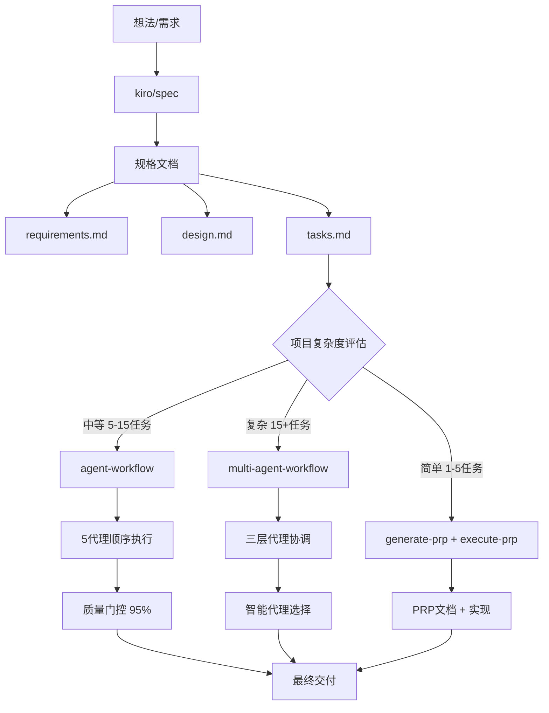

# 工作流指令使用指南

> 本文档详细说明了Claude-Code-Multi-Agent系统中四个核心工作流指令的关系、使用场景和选择策略

## 📋 目录

- [指令概览](#指令概览)
- [指令关系图](#指令关系图)
- [详细使用场景](#详细使用场景)
- [选择决策树](#选择决策树)
- [实际使用示例](#实际使用示例)
- [最佳实践建议](#最佳实践建议)

## 指令概览

Claude-Code-Multi-Agent系统提供四个核心工作流指令，它们构成了一个完整的从想法到实现的开发生态系统：

| 指令 | 用途 | 复杂度 | 输出 |
|------|------|--------|------|
| `/kiro/spec` | 规格创建 | 任意 | requirements.md, design.md, tasks.md |
| `/agent-workflow` | 标准开发流程 | 中等 | 完整功能实现 + 测试 |
| `/multi-agent-workflow` | 重型协调流程 | 高 | 大型项目实现 + 多代理协作 |
| `/generate-prp` + `/execute-prp` | 传统开发流程 | 简单 | PRP文档 + 功能实现 |

## 指令关系图



## 详细使用场景

### 1. `/kiro/spec` - 规格创建阶段

**核心作用**：将模糊想法转化为详细的技术规格

**输入格式**：
```bash
/kiro/spec "功能描述或想法"
```

**三阶段流程**：
1. **需求收集** - 生成requirements.md并与用户迭代确认
2. **设计创建** - 基于需求进行技术设计和架构规划  
3. **任务列表** - 将设计分解为可执行的编程任务

**输出文件**：
```
.kiro/specs/{feature_name}/
├── requirements.md  # 需求规格和验收标准
├── design.md        # 系统架构和技术设计
└── tasks.md         # 实施任务和优先级
```

**使用示例**：
```bash
/kiro/spec "我想做一个用户登录系统，支持邮箱和手机号登录"
```

### 2. `/agent-workflow` - 标准开发流程

**适用场景**：
- 中等复杂度项目 (5-15个任务)
- 单一或少数技术栈
- 需要质量保证的标准开发

**核心特点**：
- 5个专家代理顺序执行
- 质量门控机制 (95%分数才继续下一阶段)
- 自动反馈循环优化

**执行流程**：
```
spec-analyst → spec-architect → spec-developer → spec-validator → spec-tester
     ↓              ↓              ↓              ↓              ↓
  需求分析        系统架构        代码实现        质量验证        测试验证
```

**使用示例**：
```bash
/agent-workflow "实现用户注册登录功能，包括邮箱验证和密码重置"
```

### 3. `/multi-agent-workflow` - 重型协调流程

**适用场景**：
- 高复杂度项目 (15+任务)
- 多技术栈集成
- 需要大规模代理协作

**三层架构**：
1. **总协调器** - spec-orchestrator 制定整体策略
2. **领域专家主管** - 9个specialist管理不同领域
3. **专业执行代理** - 从100+代理中智能选择

**核心优势**：
- 智能代理选择和匹配
- 并行执行和协调管理
- 统一TODO.md任务管理
- Hook驱动自动化流程

**使用示例**：
```bash
/multi-agent-workflow "构建完整的电商平台，包括前端、后端、支付、物流等模块"
```

### 4. `/generate-prp` + `/execute-prp` - 传统开发流程

**适用场景**：
- 简单项目 (1-5个任务)
- 明确需求的小功能
- 快速原型开发

**两步流程**：
1. **生成PRP** - 基于初步需求生成详细的产品需求提示文档
2. **执行PRP** - 根据PRP文档自动实现功能

**使用示例**：
```bash
/generate-prp INITIAL.md
/execute-prp PRPs/user-login-feature.md
```

## 选择决策树

### 第一步：需求明确度评估

```
你的需求明确吗？
├─ 否：只有模糊想法
│   └─ 使用 /kiro/spec 先创建详细规格
└─ 是：有明确的功能需求
    └─ 继续下一步评估
```

### 第二步：项目复杂度评估

```
项目复杂度如何？
├─ 简单 (1-5个任务)
│   ├─ 功能单一 → /generate-prp + /execute-prp
│   └─ 需要质量保证 → /agent-workflow
├─ 中等 (5-15个任务)
│   └─ /agent-workflow
└─ 复杂 (15+个任务)
    └─ /multi-agent-workflow
```

### 第三步：技术栈复杂度评估

```
技术栈复杂吗？
├─ 单一技术栈
│   └─ /agent-workflow
├─ 2-3个技术栈
│   └─ /agent-workflow 或 /multi-agent-workflow
└─ 多技术栈 (4+)
    └─ /multi-agent-workflow
```

### 第四步：团队协作需求

```
需要多代理协作吗？
├─ 否：单一领域专家即可
│   └─ /agent-workflow
└─ 是：需要跨领域协作
    └─ /multi-agent-workflow
```

## 实际使用示例

### 场景1：新手用户 - 从想法到实现

```bash
# 步骤1：将想法转化为规格
/kiro/spec "我想做一个个人博客系统，支持文章发布和评论"

# 步骤2：查看生成的tasks.md，评估复杂度
# 假设生成了8个任务，属于中等复杂度

# 步骤3：使用标准工作流实现
/agent-workflow "根据 kiro/specs/personal-blog/tasks.md 实现个人博客系统"
```

### 场景2：有经验用户 - 直接开发

```bash
# 对于明确需求，直接使用工作流
/agent-workflow "实现JWT认证的用户登录系统，包括注册、登录、密码重置功能"
```

### 场景3：复杂项目 - 大型系统

```bash
# 先创建详细规格
/kiro/spec "构建企业级CRM系统，包括客户管理、销售流程、报表分析、权限控制等模块"

# 使用多层代理协调
/multi-agent-workflow "enterprise-crm-system"
```

### 场景4：快速原型 - 简单功能

```bash
# 创建初始需求文档
echo "实现一个简单的计算器功能" > INITIAL.md

# 生成和执行PRP
/generate-prp INITIAL.md
/execute-prp PRPs/calculator-feature.md
```

## 最佳实践建议

### 1. 新手推荐流程

**总是从规格开始**：
```bash
/kiro/spec "你的想法"
# 审查生成的规格文档
/agent-workflow "根据规格实现功能"
```

### 2. 专家推荐流程

**使用总协调器分析**：
```bash
@spec-orchestrator 请分析以下需求的复杂度并推荐最合适的工作流：
"你的详细需求描述"
```

### 3. 项目规模指导

| 项目规模 | 任务数量 | 推荐工作流 | 预估时间 |
|----------|----------|------------|----------|
| 小型 | 1-5个任务 | `/generate-prp` + `/execute-prp` | 1-2小时 |
| 中型 | 5-15个任务 | `/agent-workflow` | 2-8小时 |
| 大型 | 15+个任务 | `/multi-agent-workflow` | 8+小时 |

### 4. 成本控制建议

**Token消耗参考**：
- `/kiro/spec`: 低消耗 (主要用于规格生成)
- `/agent-workflow`: 中等消耗 (5个代理顺序执行)
- `/multi-agent-workflow`: 高消耗 (多代理并行协作)
- `/generate-prp` + `/execute-prp`: 低消耗 (传统流程)

**建议**：
1. 先用 `/kiro/spec` 明确需求，避免后期返工
2. 根据实际复杂度选择合适的工作流
3. 对于学习目的，优先使用 `/agent-workflow`
4. 生产环境的复杂项目才使用 `/multi-agent-workflow`

### 5. 质量保证策略

**质量门控机制**：
- `/agent-workflow` 内置95%质量门控
- `/multi-agent-workflow` 多层质量验证
- 手动验证规格文档的准确性
- 定期审查生成的代码质量

### 6. 错误处理和调试

**常见问题**：
1. **规格不准确** → 重新运行 `/kiro/spec` 并仔细审查
2. **代理选择不当** → 使用 `@spec-orchestrator` 重新分析
3. **质量不达标** → 检查质量门控反馈，调整规格
4. **任务卡住** → 查看TODO.md状态，手动干预

---

## 总结

这四个工作流指令构成了一个完整的开发生态系统：

1. **`/kiro/spec`** - 规格创建的起点
2. **`/agent-workflow`** - 标准开发的主力
3. **`/multi-agent-workflow`** - 复杂项目的重器
4. **`/generate-prp` + `/execute-prp`** - 简单快速的选择

选择合适的工作流是成功的关键。当不确定时，建议：
- 新手：总是从 `/kiro/spec` 开始
- 专家：咨询 `@spec-orchestrator` 获取建议
- 实验：先用简单工作流验证想法，再升级到复杂流程

记住：**好的规格是成功的一半，合适的工作流是效率的保证！**
